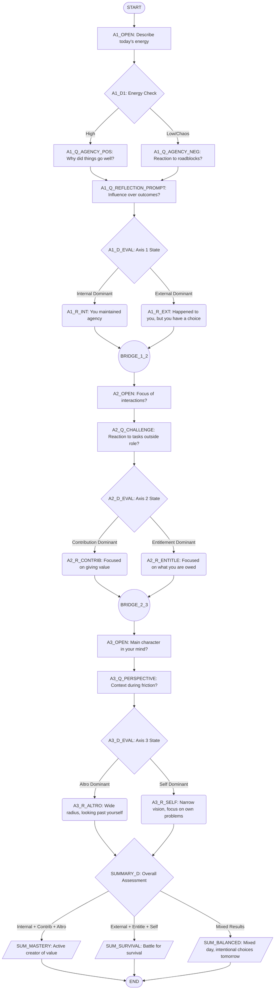

```mermaid
graph TD
    %% Axis 1: Locus (Victim vs Victor)
    START([START]) --> A1_OPEN[A1_OPEN: Describe today's energy]
    A1_OPEN --> A1_D1{A1_D1: Energy Check}
    
    A1_D1 -- High --> A1_Q_AGENCY_POS[A1_Q_AGENCY_POS: Why did things go well?]
    A1_D1 -- Low/Chaos --> A1_Q_AGENCY_NEG[A1_Q_AGENCY_NEG: Reaction to roadblocks?]
    
    A1_Q_AGENCY_POS --> A1_Q_REFLECTION_PROMPT[A1_Q_REFLECTION_PROMPT: Influence over outcomes?]
    A1_Q_AGENCY_NEG --> A1_Q_REFLECTION_PROMPT
    
    A1_Q_REFLECTION_PROMPT --> A1_D_EVAL{A1_D_EVAL: Axis 1 State}
    
    A1_D_EVAL -- Internal Dominant --> A1_R_INT(A1_R_INT: You maintained agency)
    A1_D_EVAL -- External Dominant --> A1_R_EXT(A1_R_EXT: Happened to you, but you have a choice)
    
    A1_R_INT --> BRIDGE_1_2((BRIDGE_1_2))
    A1_R_EXT --> BRIDGE_1_2
    
    %% Axis 2: Orientation (Contribution vs Entitlement)
    BRIDGE_1_2 --> A2_OPEN[A2_OPEN: Focus of interactions?]
    
    A2_OPEN --> A2_Q_CHALLENGE[A2_Q_CHALLENGE: Reaction to tasks outside role?]
    
    A2_Q_CHALLENGE --> A2_D_EVAL{A2_D_EVAL: Axis 2 State}
    
    A2_D_EVAL -- Contribution Dominant --> A2_R_CONTRIB(A2_R_CONTRIB: Focused on giving value)
    A2_D_EVAL -- Entitlement Dominant --> A2_R_ENTITLE(A2_R_ENTITLE: Focused on what you are owed)
    
    A2_R_CONTRIB --> BRIDGE_2_3((BRIDGE_2_3))
    A2_R_ENTITLE --> BRIDGE_2_3
    
    %% Axis 3: Radius (Self-Centrism vs Altrocentrism)
    BRIDGE_2_3 --> A3_OPEN[A3_OPEN: Main character in your mind?]
    
    A3_OPEN --> A3_Q_PERSPECTIVE[A3_Q_PERSPECTIVE: Context during friction?]
    
    A3_Q_PERSPECTIVE --> A3_D_EVAL{A3_D_EVAL: Axis 3 State}
    
    A3_D_EVAL -- Altro Dominant --> A3_R_ALTRO(A3_R_ALTRO: Wide radius, looking past yourself)
    A3_D_EVAL -- Self Dominant --> A3_R_SELF(A3_R_SELF: Narrow vision, focus on own problems)
    
    %% Conclusion
    A3_R_ALTRO --> SUMMARY_D{SUMMARY_D: Overall Assessment}
    A3_R_SELF --> SUMMARY_D
    
    SUMMARY_D -- Internal + Contrib + Altro --> SUM_MASTERY[/SUM_MASTERY: Active creator of value/]
    SUMMARY_D -- External + Entitle + Self --> SUM_SURVIVAL[/SUM_SURVIVAL: Battle for survival/]
    SUMMARY_D -- Mixed Results --> SUM_BALANCED[/SUM_BALANCED: Mixed day, intentional choices tomorrow/]
    
    SUM_MASTERY --> END([END])
    SUM_SURVIVAL --> END
    SUM_BALANCED --> END
```
